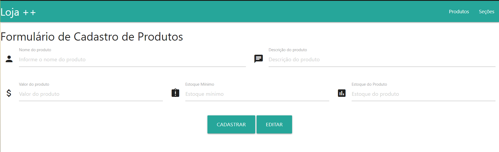

<h1 align="center"> Sistema de Vitrine Virtual </h1>

## :memo: Descrição
Este projeto consiste em um sistema de vitrine virtual para exibição e gerenciamento de produtos. O sistema é dividido em duas partes: uma API desenvolvida em Java utilizando Spring Boot para o backend e uma interface web baseada em HTML, CSS e JavaScript para o frontend. O objetivo é oferecer uma solução completa e responsiva para exibição de produtos de forma eficiente.

## :books: Funcionalidades
### Backend (API)
- Cadastro de produtos com informações detalhadas.
- Listagem e consulta de produtos por filtros.
- Atualização e exclusão de produtos.
- Integração com banco de dados para persistência de dados.

### Frontend
- Exibição responsiva de produtos em uma página interativa.
- Filtros para busca dinâmica de produtos.
- Design moderno utilizando Materialize CSS.
- Integração com a API para consumo de dados.

## :wrench: Tecnologias Utilizadas
### Backend
- **Linguagem de programação**: Java
- **Framework**: Spring Boot
- **Gerenciador de dependências**: Maven
- **Banco de Dados**: H2 (ou outro configurado no `application.properties`)

### Frontend
- **HTML5** e **CSS3** para estrutura e estilos.
- **JavaScript** (jQuery) para interatividade.
- **Materialize CSS** para design responsivo.

## Estrutura do Projeto
### Backend (`apiVitrine`)
- **`src/main`**: Código-fonte principal da API.
- **`src/test`**: Testes automatizados.
- **`pom.xml`**: Gerenciamento de dependências e configuração do projeto Maven.

### Frontend (`app`)
- **Arquivos HTML**: 
  - `index.html`: Página inicial.
  - `secoes.html`: Seções adicionais.
- **Bibliotecas (`libs`)**:
  - `jquery` e `jquery-ui` para funcionalidades dinâmicas.
  - `materialize.min.css` e `materialize.min.js` para estilização.
  - Arquivos customizados como `salaEstudo.js` e `salaEstudo.css`.

## 📷 Preview
### Frontend
#### Página Inicial

## 🧑‍🏫 Aprendizados
Durante o desenvolvimento deste projeto, aprimoramos habilidades em:
- Criação de APIs RESTful com Spring Boot.
- Integração entre frontend e backend.
- Design responsivo utilizando frameworks CSS modernos.
- Gerenciamento de dependências e organização de projetos com Maven.
- Manipulação dinâmica de conteúdo com JavaScript.

---
